# Agentischer Coding-Workflow

Dieser Leitfaden beschreibt, wie wir eine Idee agenten-gestützt von einer
informellen Notiz bis zum gemergten Code auf `main` bringen. Der Workflow ist
**projektunabhängig** – er nennt keine repo-spezifischen Details und lässt sich
so auf anderen Projekten wiederverwenden.

Die einzige Voraussetzung ist ein installiertes Skill-Set (siehe
[Voraussetzungen & Setup](#voraussetzungen--setup)). Wer die Skills nicht
installiert hat, kann den Workflow trotzdem als konzeptionelle Vorlage lesen:
Jede Phase erklärt, *was* passiert und *wer* (Mensch oder Agent) sie treibt.

Zwei Grundprinzipien tragen den gesamten Ablauf:

1. **Durable Artefakte statt langlebiger Konversation.** Jede Phase produziert
   ein persistentes Artefakt im Repo (PRD-Issue → Sub-Issues → PR). Die nächste
   Phase liest dieses Artefakt frisch ein – nicht den Gesprächsverlauf.
2. **`/clear` nach jedem Artefakt.** Genau deshalb wird der Kontext nach jeder
   artefakt-produzierenden Phase zurückgesetzt (siehe
   [Der `/clear`-Rhythmus](#der-clear-rhythmus)).

---

## Überblick

```mermaid
flowchart LR
    subgraph EP["Einstiegspunkte"]
        direction TB
        F["Neues Feature"]
        B["Neuer Bug"]
        C["Neuer Change"]
        D["DDD"]
        A["Architektur"]
    end

    S1["<b>1 · Informelle Beschreibung</b><br/>high-level in .md"]
    S2["<b>2 · Grilling</b><br/>bis 100% Alignment<br/>/grill-me · /grill-with-docs"]
    S3["<b>3 · PRD erstellen</b><br/>/to-prd → Issue"]
    S4["<b>4 · Vertikale Slices</b><br/>/to-issues → Sub-Issues"]
    S5["<b>5 · Implementierung</b><br/>/implement-prd (ultracode)<br/>TDD · Worktrees · PR"]
    S6["<b>6 · Review &amp; Merge</b>"]

    EP ==> S1
    S1 --> S2
    S2 --> S3
    S3 -- "/clear" --> S4
    S4 -- "/clear" --> S5
    S5 -- "/clear" --> S6

    classDef mensch fill:#F4C542,stroke:#B8860B,color:#000
    classDef both fill:#C9B8E8,stroke:#7B5EA7,color:#000
    classDef agent fill:#B8E0C2,stroke:#3D8B5F,color:#000
    classDef entry fill:#F6D9A0,stroke:#C08A2E,color:#000

    class S1,S6 mensch
    class S2 both
    class S3,S4,S5 agent
    class F,B,C,D,A entry
```



**Legende:** 🟡 Mensch · 🟣 Mensch + Agent · 🟢 Agent.
Ein `/clear` auf der Kante bedeutet: Kontext zurücksetzen, bevor die nächste
Phase startet. Zwischen Phase 2 und 3 steht **bewusst kein** `/clear` – `/to-prd`
verarbeitet den laufenden Grilling-Verlauf.

---

## Die Phasen im Detail

### Phase 1 – Informelle Beschreibung

- **Wer:** Mensch (optional agenten-gestützter Entwurf)
- **Skill/Trigger:** –
- **Ablauf:** Eine kurze, informelle High-Level-Beschreibung der Idee in einer
  `.md`-Datei. Kein Anspruch auf Vollständigkeit – es geht darum, den Gedanken
  festzuhalten, damit das Grilling einen Ausgangspunkt hat.
- **Output-Artefakt:** `idee.md` (o. Ä.)
- **Modell:** Opus / Fable · **Effort:** xhigh

### Phase 2 – Grilling bis 100% Alignment

- **Wer:** Mensch + Agent
- **Skill/Trigger:** `/grill-me` – oder `/grill-with-docs`, wenn der Change
  größer ist und einen neuen ADR bzw. die Änderung eines bestehenden ADR
  erfordert.
- **Ablauf:** Der Agent interviewt den Menschen so lange, bis 100% Alignment
  über Scope, Design und Trade-offs besteht – jede Verzweigung des
  Entscheidungsbaums wird aufgelöst. Werden dabei **Architekturentscheidungen**
  getroffen, werden diese als **ADR** dokumentiert (das leistet
  `/grill-with-docs` inline, zusammen mit Updates an `CONTEXT.md`).
- **Output-Artefakt:** gemeinsames Verständnis; ggf. neue/aktualisierte ADR(s)
- **Modell:** Opus / Fable · **Effort:** xhigh

### Phase 3 – PRD als Issue erstellen

- **Wer:** Agent
- **Skill/Trigger:** `/to-prd` → danach **`/clear`**
- **Ablauf:** `/to-prd` läuft im **selben Kontext** wie das Grilling und
  verdichtet die Konversation zu einem Product Requirements Document, das als
  Issue im Repo angelegt wird. Sobald das PRD-Issue existiert, ist der
  Gesprächsverlauf entbehrlich → **`/clear`**.
- **Output-Artefakt:** PRD-Issue
- **Modell:** Opus / Fable · **Effort:** xhigh

### Phase 4 – Vertikale Slices

- **Wer:** Agent
- **Skill/Trigger:** `/to-issues` → danach **`/clear`**
- **Ablauf:** In frischem Kontext liest `/to-issues` das PRD-Issue und bricht es
  in **vertikale Slices** (Tracer-Bullet-Schnitte) auf – für jeden Slice ein
  eigenes, unabhängig greifbares Sub-Issue. Abhängigkeiten zwischen den Slices
  werden als Blocker-Graph festgehalten. Danach **`/clear`**.
- **Output-Artefakt:** Sub-Issues mit Dependency-Graph
- **Modell:** Opus / Fable · **Effort:** high–xhigh

### Phase 5 – Implementierung orchestrieren

- **Wer:** Agent
- **Skill/Trigger:** `/implement-prd` (**ultracode**) → danach **`/clear`**
- **Ablauf:** In frischem Kontext orchestriert `/implement-prd` die
  Implementierung **aller** Sub-Issues und respektiert dabei den
  Dependency-Graph. Jedes Sub-Issue wird **test-first** (`/tdd`,
  Red-Green-Refactor) in einem **isolierten Git-Worktree** umgesetzt und, sobald
  fertig, in einen frischen Integrations-Branch gemergt. Der ultracode-Agent
  prüft den erzeugten Code zusätzlich selbst. Ergebnis: **ein PR gegen `main`**
  plus Sub-PRs. Danach **`/clear`**.
- **Output-Artefakt:** PR → `main` + Sub-PRs
- **Modell:** Opus · **Effort:** xhigh (ultracode)

### Phase 6 – Code Review & Merge

- **Wer:** Mensch
- **Skill/Trigger:** – (kein separater Review-Schritt)
- **Ablauf:** Der Mensch sichtet den PR und die Sub-PRs und merged nach `main`.
  Ein **eigener** Code-Review-Schritt ist aktuell nicht vorgesehen: Die Qualität
  wird bereits in Phase 5 durch **TDD** und die **Selbstprüfung des
  ultracode-Agents** sichergestellt. Phase 6 ist der menschliche Sanity-Check
  und die finale Merge-Entscheidung.
- **Output-Artefakt:** gemergter Code auf `main`
- **Modell:** – · **Effort:** –

---

## Übersicht: Modell & Effort pro Phase

| # | Phase | Wer | Skill / Trigger | Output-Artefakt | Modell | Effort |
|---|-------|-----|-----------------|-----------------|--------|--------|
| 1 | Informelle Beschreibung (`.md`) | Mensch | – | `idee.md` | Opus / Fable | xhigh |
| 2 | Grilling bis 100% Alignment | Mensch + Agent | `/grill-me` → `/grill-with-docs` (bei ADR-relevanten Changes) | Shared understanding, ADR(s) | Opus / Fable | xhigh |
| 3 | PRD erstellen (*selber Kontext wie 2*) | Agent | `/to-prd` → `/clear` | PRD-Issue | Opus / Fable | xhigh |
| 4 | Vertikale Slices | Agent | `/to-issues` → `/clear` | Sub-Issues (Dependency-Graph) | Opus / Fable | high–xhigh |
| 5 | Implementierung orchestrieren | Agent | `/implement-prd` (**ultracode**) → `/clear` | PR → `main` + Sub-PRs | Opus | xhigh |
| 6 | Code Review & Merge | Mensch | – | gemergter Code auf `main` | – | – |

**Modelle** – von leistungsstark/teuer zu schnell/günstig: **Opus** (stärkstes
Reasoning), **Fable**, Sonnet, Haiku. Für die denk-intensiven Phasen 1–4 sind
Opus oder Fable gesetzt.

**Effort** – die investierte Reasoning-Tiefe pro Schritt:
`low < medium < high < xhigh < max`. Höherer Effort = gründlicher, aber langsamer
und teurer.

**ultracode** – der Multi-Agent-Orchestrierungsmodus (mehrere Sub-Agenten laufen
parallel unter einem koordinierenden Haupt-Agenten). `/implement-prd` nutzt ihn,
um viele Sub-Issues gleichzeitig in isolierten Worktrees abzuarbeiten.

---

## Der `/clear`-Rhythmus

`/clear` setzt den Kontext des Agenten zurück. Im Workflow ist es **kein Detail,
sondern zentral**:

- **Nach `/to-prd`**, **nach `/to-issues`** und **nach `/implement-prd`** wird
  jeweils `/clear` ausgeführt.
- Grund: Jede dieser Phasen persistiert ihr Ergebnis als **durables Repo-Artefakt**
  (PRD-Issue → Sub-Issues → PR). Die nächste Phase liest dieses Artefakt frisch
  ein und braucht den vorherigen Gesprächsverlauf nicht. Ein sauberer Kontext
  hält den Agenten fokussiert und verhindert, dass alte Diskussion die nächste
  Phase verwässert.
- **Ausnahme:** Zwischen **Grilling (Phase 2)** und **`/to-prd` (Phase 3)** wird
  **nicht** zurückgesetzt – `/to-prd` verdichtet genau diesen laufenden
  Konversationskontext zum PRD.

Merksatz: **`/clear`, sobald das Ergebnis im Repo steht.**

---

## Einstiegspunkte

Der Workflow ist derselbe, egal woher die Arbeit kommt. Typische Auslöser:

- **Neues Feature** – neue Funktionalität.
- **Neuer Bug** – ein Defekt, der behoben werden soll.
- **Neuer Change** – eine Änderung an bestehendem Verhalten.
- **DDD (Domain-Driven Design)** – Arbeit am Domänenmodell und an der
  ubiquitären Sprache (Glossar in `CONTEXT.md`, Bounded Contexts). Landet
  naturgemäß bei `/grill-with-docs` + ADRs.
- **Architektur** – strukturelle Entscheidungen. Ebenfalls ADR-relevant → in
  Phase 2 über `/grill-with-docs`.

Jeder dieser Einstiegspunkte mündet in Phase 1 (informelle Beschreibung) und
durchläuft anschließend denselben Ablauf.

---

## Artefakte

Kurzes Glossar der Artefakte, die der Workflow erzeugt bzw. liest:

- **PRD (Product Requirements Document)** – verdichtet das abgestimmte
  Verständnis aus dem Grilling zu einem umsetzbaren Dokument; lebt als Issue im
  Repo.
- **ADR (Architecture Decision Record)** – dokumentiert eine
  Architekturentscheidung samt Kontext und Konsequenzen. Wird in Phase 2 *lazy*
  geschrieben – nur wenn tatsächlich eine Entscheidung fällt.
- **`CONTEXT.md`** – die ubiquitäre Sprache / das Glossar des Projekts. Quelle
  der Wahrheit für Domänenbegriffe; wird von den Skills beim Erkunden gelesen.
- **Vertikale Slice** – ein Tracer-Bullet-Schnitt durch alle Schichten (statt
  horizontal nach Layer), sodass jedes Sub-Issue eigenständig lieferbar ist.

---

## Voraussetzungen & Setup

Die Skills dieses Workflows stammen aus **Matt Pococks Skills-Repo**:
[`github.com/mattpocock/skills`](https://github.com/mattpocock/skills)
(„Skills For Real Engineers").

**Installation (Kurzfassung):**

```bash
npx skills@latest add mattpocock/skills
```

Dabei die gewünschten Skills auswählen und sicherstellen, dass
`setup-matt-pocock-skills` mit dabei ist. Anschließend im Agenten ausführen:

```
/setup-matt-pocock-skills
```

Dieser Setup-Schritt konfiguriert pro Repo, was die Engineering-Skills
voraussetzen: den **Issue-Tracker** (GitHub / GitLab / lokale Markdown-Dateien),
die **Triage-Labels** und den **Ablageort der Domänen-Docs** (`CONTEXT.md`,
`docs/adr/`).

**Weiterführend / Hintergrund:** Matt Pocock –
[„Full Walkthrough: Workflow for AI Coding"](https://www.youtube.com/watch?v=-QFHIoCo-Ko)
(Video-Walkthrough des zugrunde liegenden Workflows).

---

## Skill-Referenz

Die fünf Skills, die den Workflow direkt tragen:

| Skill | Phase | Was es tut |
|-------|-------|------------|
| `/grill-me` | 2 | Interviewt relentless entlang des Entscheidungsbaums, bis 100% Alignment über den Plan besteht. |
| `/grill-with-docs` | 2 | Wie `/grill-me`, prüft aber zusätzlich gegen das bestehende Domänenmodell und aktualisiert `CONTEXT.md` / ADRs inline, sobald Entscheidungen fallen. Für größere/architektonische Changes. |
| `/to-prd` | 3 | Verdichtet den laufenden Konversationskontext zu einem PRD und legt es als Issue im Tracker an. |
| `/to-issues` | 4 | Bricht ein PRD in unabhängig greifbare Issues auf – vertikale Tracer-Bullet-Slices, inkl. Blocker-/Dependency-Graph. |
| `/implement-prd` | 5 | Orchestriert die Implementierung aller Sub-Issues eines PRD: jedes test-first in isoliertem Worktree, respektiert den Dependency-Graph, mergt in einen Integrations-Branch, endet in einem PR gegen `main`. Läuft im ultracode-Modus. |

**Unterstützende Skills:**

- `/tdd` – Test-Driven Development mit Red-Green-Refactor. Wird **innerhalb** von
  `/implement-prd` pro Sub-Issue verwendet; kann auch eigenständig laufen.
- `setup-matt-pocock-skills` – einmaliges Repo-Setup (Issue-Tracker,
  Triage-Labels, Domänen-Docs). **Voraussetzung** vor der ersten Nutzung der
  Engineering-Skills.
